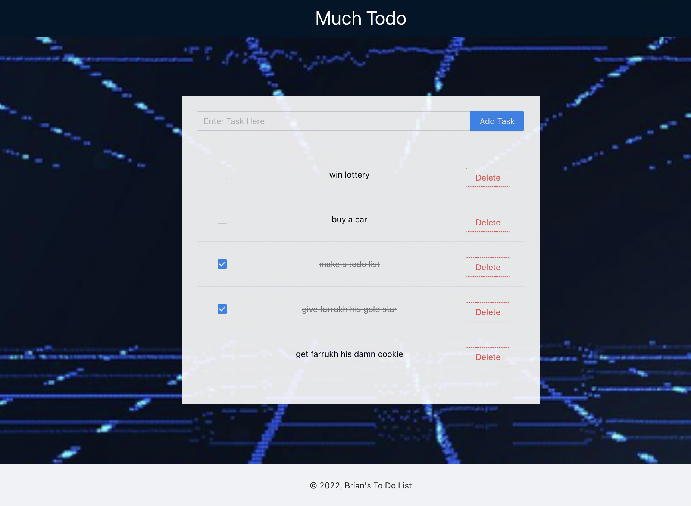

# Getting Started with Create React App

This project was bootstrapped with [Create React App](https://github.com/facebook/create-react-app).

## Created a To Do List

Simple To Do list that will keep track of your lists and is deployed through Gcloud. This also uses a firebase database to keep track of list

